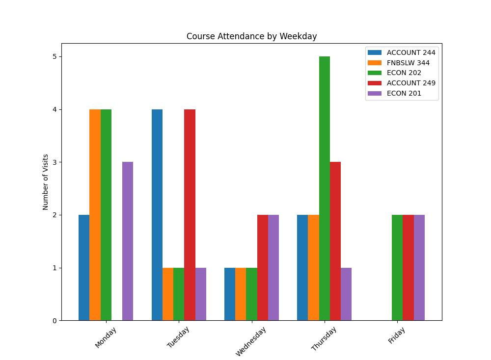

# final-project-kilchenmann

## Task 1. Setup

Manage Our Local Project Virtual Environment

After copying/forking this project and installing it locally,
use the built in venv utility to create a local project virtual environment in a folder named .venv. 

Windows: 
```shell
py -3.11 -m venv .venv
```

Mac/Linux:
```zsh
python3 -3.11 -m venv .venv
```

Run the following commands to activate our local project virtual environment 
and install necessary packages. 
Wait for each command to finish before running the next command. 

Windows: 

```shell
.venv\Scripts\activate
py -m pip install --upgrade pip setuptools wheel
py -m pip install --upgrade -r requirements.txt
py -m pip install matplotlib
```

Mac/Linux: 

```zsh
source .venv/bin/activate
python3 -m pip install --upgrade pip setuptools wheel
python3 -m pip install --upgrade -r requirements.txt
python3 -m pip install matplotlib
```

## Task 2. Start Zookeeper and Kafka (Takes 2 Terminals)

If Zookeeper and Kafka are not already running, you'll need to restart them.

1. Start Zookeeper Service 

cd ~/kafka
bin/zookeeper-server-start.sh config/zookeeper.properties

2. Start Kafka Service 

cd ~/kafka
bin/kafka-server-start.sh config/server.properties

---

## Task 3. Start a Producer (Terminal 3) 

Start the producer to generate the messages. 

If Zookeeper and Kafka services are running, it will try to write them to a Kafka topic as well.
For configuration details, see the .env file. 

In VS Code, open a NEW terminal.
Use the commands below to activate .venv, and start the producer. 

Windows:

```shell
.venv\Scripts\activate
py -m producers.csv_producer_kilchenmann
```

Mac/Linux:
```zsh
source .venv/bin/activate
python3 -m producers.csv_producer_kilchenmann
```

## Task 4. Start a Consumer (Terminal 4)

Start an associated consumer. 

In VS Code, open a NEW terminal in your root project folder. 
Use the commands below to activate .venv, and start the consumer. 

Windows:
```shell
.venv\Scripts\activate
py -m consumers.csv_consumer_kilchenmann

```

Mac/Linux:
```zsh
source .venv/bin/activate
python3 -m consumers.csv_consumer_kilchenmann

```

---

## What the Consumer Does

The consumer will generate a histogram showing how many students visit tutoring by course on each day of the week.  This helps planning for having the right tutors available on each day of the week.



